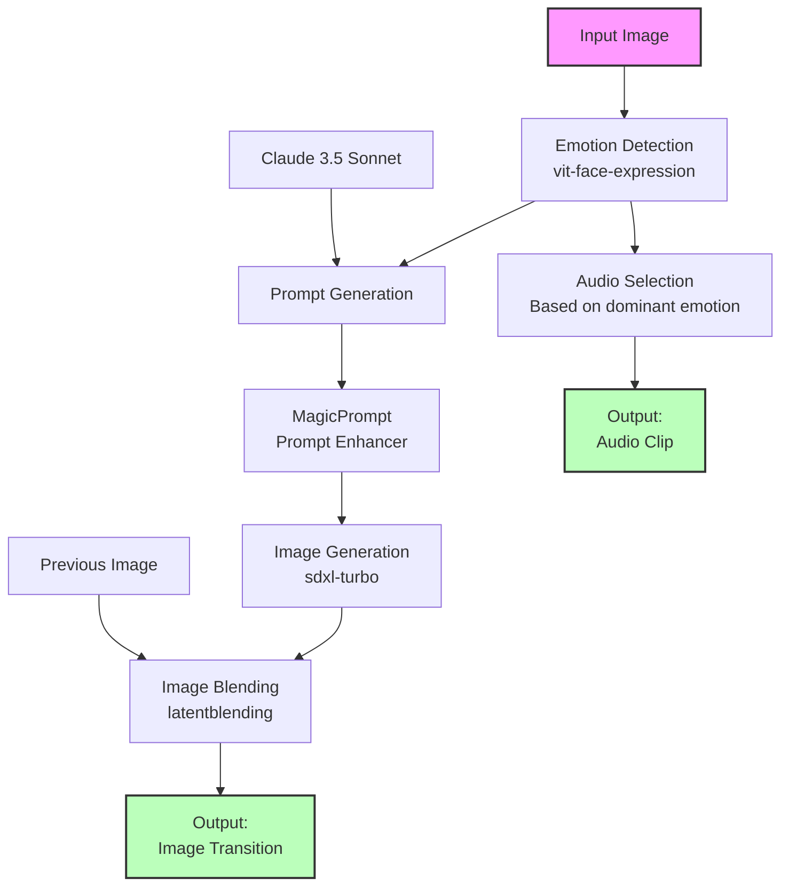

# Emotion-Based Image Generator
## How to use
### Setup

*NOTE:* This project was built using python 3.11 other versions are not guaranteed to work.

Steps:

1. Clone this repository
2. *Windows only:* Make sure you have Visual Studio C++ installed.
https://visualstudio.microsoft.com/vs/features/cplusplus/ 
3. *Optional:* Create a new virtual environment:
   ```
   python -m venv .venv
   source .venv/bin/activate
   ```
4. Install the required dependencies:
   ```
   pip install -r requirements.txt
   ```
5. Clone the latentblending repository:
   - Option 1: Base Repo   
   ```
   git clone https://github.com/lunarring/latentblending.git
   ```
   - Option 2: My Forked Repo (this was changed to work for mac)
   ```
   git clone https://github.com/ConnorMacdonaldYYC/latentblending.git
   ```
6. Create a `.env` file in the project root and add your API key:
   - Windows Version   
   ```
   copy temp.env .env
   ```
   - Mac Version   
   ```
   cp temp.env .env
   ```
   *NOTE:* You will need an active anthropic API key to run this program. Reach out to c.s.macdonald@students.uu.nl for access.
8. Download the audio files and place them in the `src/sounds/` directory.
Files are located here: https://drive.google.com/drive/folders/1MvQvd-2zPVnOW3um2M0phpwjqw5pwihM?usp=sharing


### Usage

Run the main script:
```
python main.py
```

## Project Description
The ideas behind this project was to create an interactive and personable way for people to engage with generative AI tools. This project uses images and sound to attempt to mirror the emotions detected on people faces. 

The implementation consists of 3 main components: emotion detection, image generation, and audio generation.

1. Emotion Detection 
   This component takes a image and using a pre-trained vision transformer from Hugging Face ([vit-face-expression](https://huggingface.co/trpakov/vit-face-expression)), it attempts to classify the emotion being displayed by all the faces in the image. 
   The range of emotions detected are:
   - Angry
   - Disgust
   - Fear
   - Happy
   - Neutral
   - Sad
   - Fear
2. Image Generation and Blending
   This component takes a list of emotions and generates an image from this list. 
   2.1 Prompt Generation
   To do this claude sonnet 3.5 was used to generate a prompt for a stable diffusion model. Additionally this prompt was modifed by a model designed to enhance prompt description ([MagicPrompt](https://huggingface.co/Gustavosta/MagicPrompt-Stable-Diffusion)).
   2.2 Image Generation
   This image was then generated using a pre-trained stable diffusion model from Hugging Face ([stabilityai/sdxl-turbo](https://huggingface.co/stabilityai/sdxl-turbo)). 
   2.3 Image Blending
   The generated image was then blended with the previous image using the latent blending technique ([latentblending](https://github.com/lunarring/latentblending.git)). This technique merges the latent space of the two images to create new images that are combination of the two. This enables a smooth transition between the two images.
3. Audio Generation
   This component takes the most commonly detected emotion and choose 1 of 3 pre-generated audio clips to play.
   The audio clips are generated -------


These components work together to create a loop in `main.py` that continuously takes in images and outputs new images, audio, and blends the new image with the previous one.
### Project Flow Diagram



### Ethical Considerations
This project showcases an example of how generative AI can be used to create a more interactive and engaging experience. However, it also showcases how these tools can be used to manipulate and control people. It also raises the issue of privacy as images of people faces are being captured and used to generate new images. It is important to be aware of these potential negative impacts and use generative AI responsibly.

**NOTE:** The face captured with this program are not saved or sent to any external servers. All facial detection and image processing is done locally. The only information sent to a remote server is the list of detected emotions.

## Work Breakdown and AI Tool Use
### AI Tools Uses:
#### AI Tools used by the program:
- [vit-face-expression](https://huggingface.co/trpakov/vit-face-expression) for emotion detection
- [Claude 3.5 Sonnet](https://www.anthropic.com/docs/api-reference/claude-3-sonnet) for prompt generation
- [MagicPrompt](https://huggingface.co/Gustavosta/MagicPrompt-Stable-Diffusion) for prompt enhancement
- [sdxl-turbo](https://huggingface.co/stabilityai/sdxl-turbo) for image generation
- [latentblending](https://github.com/lunarring/latentblending.git) for image blending
- [somthing]() for audio generation

#### AI Tools uses in creation of the project: 
- Claude 3.5 Sonnet and the AI IDE Cursor were used to help create the code for this project

### Work Breakdown
Connor Macdonald: Emotion Detection, Image Generation, Image Blending
Patrick: Project Presentation Video, Planning and testing of other ideas
Tijmen: Audio Generation, Testing

